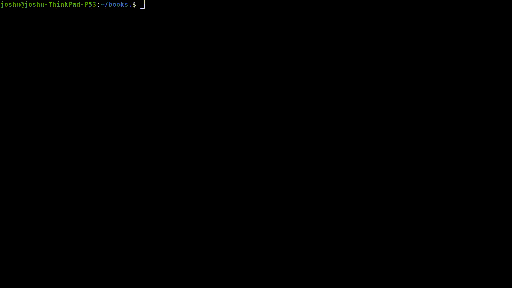

# mvpls
Mvpls (move please) is a simple utility tool written in Go to allow for the recursive moving of files and flattening of file trees with regex.

In this example, every pdf file within my books directory and its subdirectories is moved to a seperate folder.

Why are my pdfs executable? Idk calibre did that to them for some reason.

it's still in development lol.

You could say, can't we easily do this by piping a few [standard commands](https://superuser.com/a/1041895/1225558)?
And you'd be right. But I wanted to make this anyway :P. Also Go is fun to code in so I can't be wrong there.

It also works just like the POSIX `mv` command so can move files like regular when n flag is passed. Do I get a POSIX compliant badge??

## Why GO?
The correct question is why not Go? I mostly chose Go because it looks fun and is cross platform. My two largest desires for applications.

### Pressing features
- Key feature allowing you to thank mvpls if it succeeds.
- Cache operations to allow for a possible revert flag
- Obviously add the ability to copy or remove.
